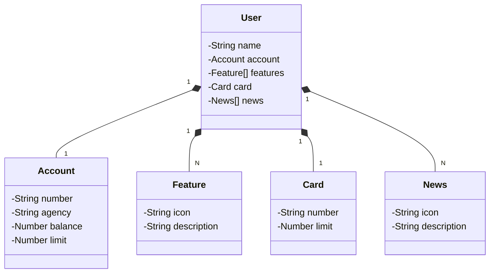

# Santander Dev Week 2024

Java RESTful API criada para dev week santader 2024.

## Principais Tecnologias
- **Java 17**: A versão LTS mais recente do Java foi utilizada para aproveitar as inovações dessa linguagem robusta e amplamente utilizada;
- **Spring Boot 3**: A nova versão do Spring Boot foi escolhida para maximizar a produtividade por meio de sua poderosa premissa de autoconfiguração;
- **Spring Data JPA**: Essa ferramenta foi explorada para simplificar a camada de acesso aos dados, facilitando a integração com bancos de dados SQL;
- **OpenAPI (Swagger)**: A documentação de API foi criada de maneira eficaz e fácil de entender utilizando a OpenAPI (Swagger), alinhada com a alta produtividade que o Spring Boot oferece;
- **Railway**: Foi utilizada para facilitar o deploy e monitoramento das soluções na nuvem, além de oferecer diversos bancos de dados como serviço e pipelines de CI/CD.

## [Link do Figma](https://www.figma.com/file/0ZsjwjsYlYd3timxqMWlbj/SANTANDER---Projeto-Web%2FMobile?type=design&node-id=1421%3A432&mode=design&t=6dPQuerScEQH0zAn-1)

O Figma foi utilizado para a abstração do domínio desta API, sendo útil na análise e projeto da solução.

## Diagrama de classes

## Documentação da API (Swagger)

### [https://sdw-2024-api-vivian.up.railway.app/swagger-ui/index.html](https://sdw-2024-api-vivian.up.railway.app/swagger-ui/index.html)

Esta API ficará disponível no Railway por um período de tempo limitado, mas este é um código-fonte aberto. Baseado na solução da dio [https://github.com/digitalinnovationone/santander-dev-week-2023-api](https://github.com/digitalinnovationone/santander-dev-week-2023-api)

